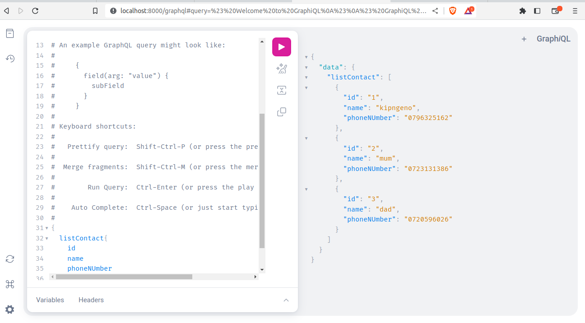

# DJANGOQL

here's my first ever graphQL api



## running queries in GraphQL

so in your schema (just like serializers in rest apis), you defined a query:

```python
class Query(graphene.ObjectType):
    list_contact=graphene.List(ContactType)

    def resolve_list_contact(root, info):
        return Contact.objects.all()

```

this is the query we are going to be running in GraphQL in-browser client

## GRAPHQL CRUD

CRUD means:

1. create
2. read
3. update
4. delete

### Read

we want to be able to query the API with a particular id and then we retrieve the data associated with it.

so our schema had a `resolve_list_contact` method, that was enabling us to retrieve the list of contacts resent in our database

for us to get for one specific contact using a specific id, we are going to add another function:

```python
def resolve_read_contact(root, info, id):
    return NameOfModels.objects.get(id=id)
```

this functioon will enable us to query the API for a specific contact

one thing you must note is that will we add the def `resolve_read_contact` method, we also need to define the `read_contact` just lines above the definition of method definitions.

i.e:

```python
read_contact = graphene.Field(ContactType, id = graphene.Int())
```

### create

to create a new data 